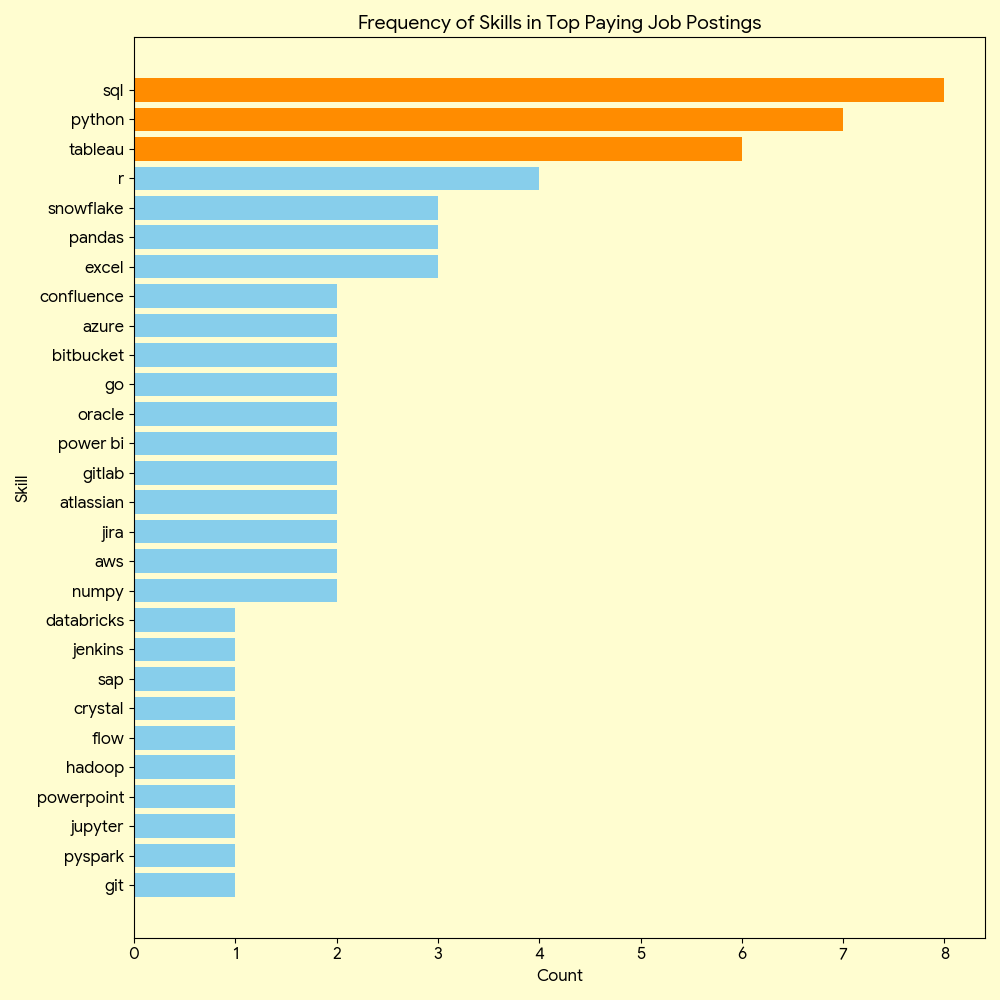

# Data Analyst Job Market Analysis

## Introduction 
Welcome to my Data Job Market Analysis project. This study focuses on the Data Analyst landscape to identify top-paying roles, high-demand skills, and the strategic intersection where salary potential meets market stability.

Explore the Analysis:  🔍 **Looking for the SQL queries?** Check them out in the [`project_sql`](./project_sql) folder.

## Background 
This project originated from a need to navigate the data career path more strategically. By pinpointing the most lucrative and sought-after technical skills, I aimed to create a data-driven roadmap for finding optimal career opportunities. The dataset—sourced from **Luke Barousse's** SQL Course—provides a comprehensive look at job titles, compensation, geographic trends, and required competencies.

## Research Questions

1. Which Data Analyst roles offer the highest compensation?

2. What specific skills do these premium roles require?

3. Which skills are currently most in-demand across the industry?

4. How do specific skills correlate with salary increases?

5. What are the "optimal" skills to learn (high demand + high pay)?

### Technical Stack

* SQL: The core engine used for data extraction and analytical querying.

 * PostgreSQL: The primary database management system used to organize job posting data.

* Visual Studio Code: My integrated development environment for writing and executing scripts.

* Git & GitHub: Utilized for version control, documentation, and sharing my findings.

## The Analysis 
My approach was to treat each research question as a specific data problem. I utilized advanced SQL techniques to extract actionable insights from the dataset:

 ### 1. Top-Paying Data 

Top-Paying Data Analyst Jobs To identify the most lucrative opportunities, I queried job roles based on average annual compensation. By filtering for remote-only positions, I focused on the highest-paying, flexible roles that are currently shaping the modern data landscape. This query uncovers which companies and titles offer the best financial ROI.
```sql
    SELECT
    job_id,
    job_title,
    job_location,
    job_schedule_type,
    salary_year_avg,
    job_posted_date,
    name AS company_name -- Include company name for better context
FROM
    job_postings_fact
LEFT JOIN
    company_dim USING (company_id) -- Join to get company names
WHERE
    job_title_short = 'Data Analyst' AND
    job_location = 'Anywhere' AND
    salary_year_avg IS NOT NULL -- Exclude jobs without specified salaries
ORDER BY
    salary_year_avg DESC
LIMIT 10;
```
## Key Findings:
 * Analyst Roles The analysis of 2023–2024 job postings reveals a lucrative landscape for data professionals, characterized by three main trends:

* Significant Compensation Ceiling: Top-tier salaries range from $184,000 to $650,000. This wide interval suggests that while entry-level pay is stable, specialized roles and leadership positions offer exponential growth potential.

* Cross-Industry Demand: High-paying opportunities are not limited to Big Tech. Major players across finance (SmartAsset), telecommunications (AT&T), and social media (Meta) are competing for top talent, proving the value of data analytics in every sector.

* Specialization vs. Generalization: The variety in job titles—ranging from Data Analyst to Director of Analytics—highlights a clear career progression. Higher salaries are closely tied to specialized expertise and strategic management responsibilities.


Bar graph visualizing the salary for the top 10 salaries for data analysts; ChatGPT generated this graph from my SQL query results

### 2. Skills for Top-Paying Jobs

To identify the technical requirements of the highest-earning roles, I performed a join between the job postings and skills datasets. This allowed me to map specific competencies to their market value and uncover the core proficiencies that employers prioritize for high-compensation positions.
```sql
WITH top_paying_jobs AS (
    SELECT	
        job_id,
        job_title,
        salary_year_avg,
        name AS company_name
    FROM
        job_postings_fact
    LEFT JOIN company_dim ON job_postings_fact.company_id = company_dim.company_id
    WHERE
        job_title_short = 'Data Analyst' AND 
        job_location = 'Anywhere' AND 
        salary_year_avg IS NOT NULL
    ORDER BY
        salary_year_avg DESC
    LIMIT 10
)

SELECT 
    top_paying_jobs.*,
    skills
FROM top_paying_jobs
INNER JOIN skills_job_dim ON top_paying_jobs.job_id = skills_job_dim.job_id
INNER JOIN skills_dim ON skills_job_dim.skill_id = skills_dim.skill_id
ORDER BY
    salary_year_avg DESC;
```

Bar graph visualizing the count of skills for the top 10 paying jobs for data analysts; ChatGPT generated this graph from my SQL query results

### 3. In-Demand Skills for Data Analysts
This query helped identify the skills most frequently requested in job postings, directing focus to areas with high demand.

```sql
SELECT
  skills,
  COUNT(skills_job_dim.skill_id) AS demand_count
FROM
    job_postings_fact
INNER JOIN skills_job_dim USING (job_id) -- Join to get skills for the top-paying jobs
INNER JOIN skills_dim USING (skill_id) -- Join to get skill names
WHERE
  job_title_short = 'Data Analyst' AND-- Focus on data analyst roles
  job_work_from_home = True -- Consider only remote jobs
GROUP BY
  skills
ORDER BY
  demand_count DESC
LIMIT 5; -- Limit to top 5 results
```
Here's the breakdown of the most demanded skills for data analysts in 2023

* Core Foundations: SQL and Excel remain the industry standard, serving as the essential bedrock for data retrieval and processing.

* Technical Stack: Python, Tableau, and Power BI are increasingly critical, highlighting the shift toward automated analysis and visual data storytelling.

| Skills   | Demand Count |
|----------|--------------|
| SQL      | 7291         |
| Excel    | 4611         |
| Python   | 4330         |
| Tableau  | 3745         |
| Power BI | 2609         |

*Table of the demand for the top 5 skills in data analyst job postings*

### 4. Skills Based on Salary
Exploring the average salaries associated with different skills revealed which skills are the highest paying.
```sql
SELECT
    skills,
    ROUND(AVG(salary_year_avg), 0) AS average_salary
FROM job_postings_fact
INNER JOIN skills_job_dim USING (job_id)
INNER JOIN skills_dim USING (skill_id)
WHERE
    job_title_short = 'Data Analyst' 
    AND salary_year_avg IS NOT NULL -- Consider only jobs with specified salaries
    AND job_work_from_home = True
GROUP BY skills
ORDER BY average_salary DESC
LIMIT 25;
```
Here's a breakdown of the results for top paying skills for Data Analysts:
* Big Data & Machine Learning: Mastery of PySpark, Pandas, and Jupyter commands a premium, as firms value advanced data processing and predictive modeling.

* Data Engineering & DevOps: Proficiency in Airflow, Kubernetes, and GitLab represents a lucrative crossover into engineering, highlighting the demand for automated, scalable data pipelines.

* Cloud Architecture: Expertise in Databricks, GCP, and Elasticsearch underscores the shift toward cloud-native analytics environments as a major salary driver.

| Skills        | Average Salary ($) |
|---------------|-------------------:|
| pyspark       |            208,172 |
| bitbucket     |            189,155 |
| couchbase     |            160,515 |
| watson        |            160,515 |
| datarobot     |            155,486 |
| gitlab        |            154,500 |
| swift         |            153,750 |
| jupyter       |            152,777 |
| pandas        |            151,821 |
| elasticsearch |            145,000 |

*Table of the average salary for the top 10 paying skills for data analysts*

### 5. Most Optimal Skills to Learn
Combining insights from demand and salary data, this query aimed to pinpoint skills that are both in high demand and have high salaries, offering a strategic focus for skill development.
```sql
WITH skill_demand AS (
  SELECT
    skills,
    skill_id,
    COUNT(skills_job_dim.skill_id) AS demand_count
  FROM job_postings_fact
  INNER JOIN skills_job_dim USING (job_id)
  INNER JOIN skills_dim USING (skill_id)
  WHERE
    job_title_short = 'Data Analyst'
    AND job_work_from_home = True
    AND salary_year_avg IS NOT NULL
  GROUP BY skill_id, skills
), avg_salary AS (
  SELECT
    skills,
    skill_id,
    ROUND(AVG(salary_year_avg), 0) AS average_salary
  FROM job_postings_fact
  INNER JOIN skills_job_dim USING (job_id)
  INNER JOIN skills_dim USING (skill_id)
  WHERE
    job_title_short = 'Data Analyst'
    AND job_work_from_home = True
    AND salary_year_avg IS NOT NULL
  GROUP BY skill_id, skills
)

SELECT
  skill_demand.skill_id,
  skill_demand.skills AS skill,
  skill_demand.demand_count,
  avg_salary.average_salary
FROM skill_demand
INNER JOIN avg_salary USING (skill_id)
WHERE skill_demand.demand_count > 10
ORDER BY average_salary DESC, demand_count DESC
LIMIT 25;

-- re-writing same query more concisely

SELECT
skills_dim.skill_id,
skills_dim.skills,
COUNT(skills_job_dim.skill_id) AS demand_count,
ROUND(AVG(job_postings_fact.salary_year_avg), 0) AS average_salary
FROM job_postings_fact
INNER JOIN skills_job_dim USING (job_id)
INNER JOIN skills_dim USING (skill_id)
WHERE
  job_postings_fact.job_title_short = 'Data Analyst'
  AND job_postings_fact.job_work_from_home = True
  AND job_postings_fact.salary_year_avg IS NOT NULL
GROUP BY skills_dim.skill_id
HAVING COUNT(skills_job_dim.skill_id) > 10
ORDER BY average_salary DESC, demand_count DESC
LIMIT 25;
```
| Skill ID | Skills     | Demand Count | Average Salary ($) |
|----------|------------|--------------|-------------------:|
| 8        | go         | 27           |            115,320 |
| 234      | confluence | 11           |            114,210 |
| 97       | hadoop     | 22           |            113,193 |
| 80       | snowflake  | 37           |            112,948 |
| 74       | azure      | 34           |            111,225 |
| 77       | bigquery   | 13           |            109,654 |
| 76       | aws        | 32           |            108,317 |
| 4        | java       | 17           |            106,906 |
| 194      | ssis       | 12           |            106,683 |
| 233      | jira       | 20           |            104,918 |

*Table of the most optimal skills for data analyst sorted by salary*

* Programming & Logic: Python and R lead in volume (236 and 148 mentions respectively). While widespread, they remain essential foundational tools with average salaries exceeding $100k.

* Cloud & Big Data: Expertise in Snowflake, Azure, AWS, and BigQuery commands higher-than-average pay, marking cloud proficiency as a key differentiator for high-value analysts.

* BI & Data Storytelling: Tableau and Looker are critical for converting data into strategy. Looker, in particular, carries a higher salary premium ($103,795), reflecting its niche strategic value.

* Database Management: Proficiency in Oracle, SQL Server, and NoSQL remains indispensable, with salaries ranging from $97k to $104k, proving that core data infrastructure skills are still highly rewarded.

# What I Learned
- **🧩 Complex Query Crafting:** Mastered the art of advanced SQL, merging tables like a pro and wielding WITH clauses for ninja-level temp table maneuvers.
- **📊 Data Aggregation:** Got cozy with GROUP BY and turned aggregate functions like COUNT() and AVG() into my data-summarizing sidekicks.
- **💡 Analytical Practice:** Leveled up my real-world puzzle-solving skills, turning questions into actionable, insightful SQL queries.

# Conclusions

### Insights
🏁 Final Project Insights

1. Compensation Ceiling: Remote Data Analyst roles show a massive salary ceiling, peaking at $650,000, highlighting the high value of specialized data expertise.

2. The Power of SQL: SQL is the ultimate "double threat"—it is both the most demanded skill by employers and a requirement for the highest-paying roles.

3. Specialized Premium: Specialized skills like SVN and Solidity command the highest average salaries, proving that niche expertise leads to premium pay.

4. Strategic Learning: For maximum market value, SQL offers the best return on investment, while combining it with cloud or niche tools unlocks top-tier compensation.

## Closing Thoughts

This project enhanced my SQL skills and provided valuable insights into the data analyst job market. The findings from the analysis serve as a guide to prioritizing skill development and job search efforts. Aspiring data analysts can better position themselves in a competitive job market by focusing on high-demand, high-salary skills. This exploration highlights the importance of continuous learning and adaptation to emerging trends in the field of data analytics.


